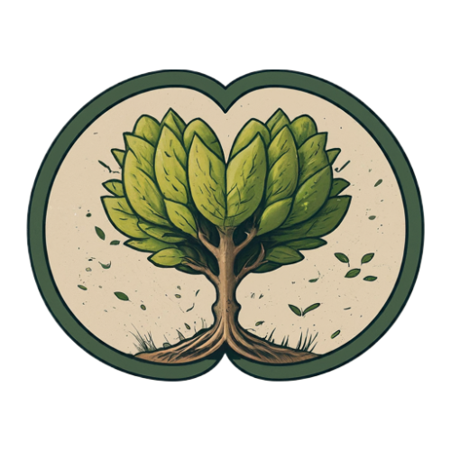

`npm i crann`

Crann synchronizes state in Web Extensions, with full Typescript support.

- Minimal size (< 5kb)
- Syncs state between any context you might want - Content Scripts, Devtools, Sidepanels, Popup etc.
- Removes the need for a tangled web of message passing
- React to state! Better coding patterns.
- Optionally persist any value to storage (local or session) via config.

Examples: Coming soon.

### First, create a Crann instance

Crann needs a service worker to coordinate state and access

```typescript
// service worker environment
import { create } from 'crann'

// Create an state with some defaults
const crann = create({
    active: {default: false} // types are inferred from provided default
    trees: {default: 0}
    name: {default: '', partition: Partition.Instance} // partitioned state will be different for each connected context, so everyone connected except the service worker
});

// Get the state whenever you like. 
const {active, trees} =  crann.get() // Not passing in a key will only get state that is common to all, aka no partitioned state
const {active, trees, name} = crann.get('instancekey') // Passing in a key will return the common state AND the partitioned state for that instance

// subscribe to listen for state changes
crann.subscribe( (state, changes, key) => {
    const { active, trees, name } = state;
    console.log('Common state: active: ', active, ', trees: ', trees);
    console.log(`Instance state for ${key}: `, name);
    // or just look at changes.

    // key will be the id of the context that made the state update, or null if the update came from the service worker (here)
});

// Set the state (either for an instance or for the common state)
crann.set({active: true}) // Will notify all connected contexts that active is now true.
crann.set({name: 'ContentScript'}, 'instancekey'); // Or set for a particular instance if you like
```

### Then, connect to your Crann instance from any context you like -- eg. content scripts

```typescript
import {connect} from 'crann';
const {get, set, subscribe} = connect();

// Similar to the service worker environment, except we will always be dealing with common state AND our own instance state. No distinction from our point of view.
const {active, trees, name} = get();

// Set the state
set({name: 'My own name'})

// subscribe to listen for a particular item of state changing, or any change
subscribe((changes) => {
    console.log('Trees changed! new value: ', changes.trees)
}, ['trees']);

```

### Finally, Persist state!

You can persist items so that they will survive a refresh or context closure.

Session state: Will last between page refreshes, generally will reset if the user closes the tab or browser.
Local state: Will persist long-term (unless the user specifically clears it in browser settings)

```typescript
// Simply add persistence to your config when creating crann in the service-worker

const crann = create({
    active: {default: false} // types are inferred from provided default
    trees: {default: 0}
    name: {default: '', partition: Partition.Instance} // partitioned state will be different for each connected context, so everyone connected except the service worker
    timesUsed: {default: 0, Persistence.Local}
    firstOpened: {default: new Date(), Persistence.Session}
});

// note: Persisted state is Common state by default (shared with all contexts)
```